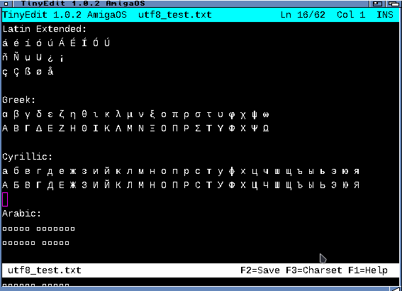
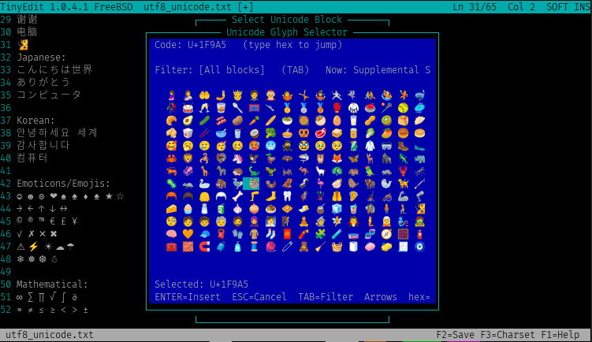
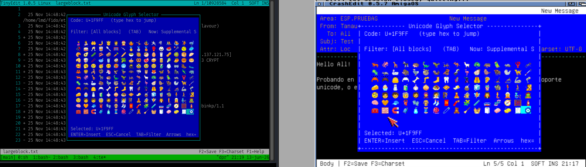

# tinyedit

A lightweight text editor for AmigaOS, Linux, and Windows using ncurses

## Features

- Full UTF-8 support with charset conversion (internal UTF-8, configurable output)
- Multiple charset support: UTF-8, LATIN-1/2, CP437, CP850, CP865, CP866, CP1252
- TTF rendering with full Unicode support (including emojis) on AmigaOS
- Configurable colors and fonts
- Auto-wrap and hard-wrap modes
- Undo/redo support
- Search functionality
- Clipboard support
- Bracketed paste support (Unix/Linux)
- Customizable via config file

## Building

### Linux/BSD/macOS
```bash
make -f Makefile.unix
```

### AmigaOS
```bash
For AmigaOS the program use ttengine or freetype with libpng and zlib

Using bebbo gcc

https://aminet.net/package/util/libs/ttengine-68k

libpng: https://www.libpng.org/
zlib: https://zlib.net/
FreeType: https://freetype.org/

To compile:

In tinyedit directory:

To ttengine.library: make -f Makefile.amiga

To static freetype with libpng and zlib:
Extract the files freetype-2.14.3.tar.xz, libpng-1.6.58.tar.xz and, zlib.tar.gz
into CrashEdit and rename them to freetype, zlib, and libpng.

To prepair headers:
make -f Makefile.amiga.te unprep
make -f Makefile.amiga.te prep
make -f Makefile.amiga.te clean all

Freetype fonts tested:

Symbola.ttf
unifont_sample-17.0.04.otf
NotoColorEmoji-emojicompat.ttf
Symbola_hint.ttf
NotoSansCJK-Regular.ttf
NotoColorEmoji.ttf
DejaVuSansMono.ttf
LiberationMono-Regular.ttf

With ttengine:

DejaVuSansMono.ttf
LiberationMono-Regular.ttf

The executable is large, but you don't need any libraries. It's optimized for RTG and also works with OCS, ECS, or AGA.
```

### Windows
```bash
From msys2 with mingw x32 or x64

make -f Makefile.win32
```

## Usage

```bash
tinyedit [filename]
```

## Configuration

Config file location:
- Linux/Unix: `~/.tinyedit.conf`
- AmigaOS: `ENVARC:tinyedit.cfg`
- Windows: `tinyedit.cfg`

## UTF-8 and Charset Support

tinyedit works internally with UTF-8 and provides flexible charset conversion:

- **Default charset**: Configurable via Setup (F4) - used when saving files
- **Per-file charset**: Temporary override via F3 for viewing/saving specific files
- **TTF encoding** (AmigaOS): UTF-8 mode supports full Unicode (0x000000-0x10FFFF) including emojis

Supported charsets for conversion:
- UTF-8 (modern standard, full Unicode)
- LATIN-1 (ISO-8859-1, Western European)
- LATIN-2 (ISO-8859-2, Central European)
- CP437 (DOS/PC original)
- CP850 (DOS Western European)
- CP865 (DOS Nordic)
- CP866 (DOS Cyrillic/Russian)
- CP1252 (Windows Western European)

=========
Screenshots
=========









## License

GPL-2.0 - see LICENSE file for details


