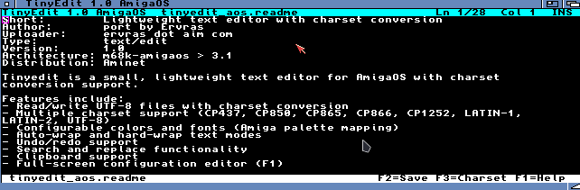
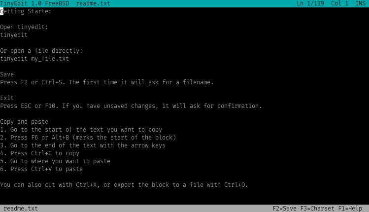
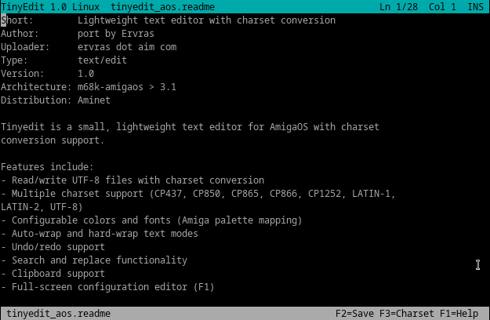

# tinyedit

A lightweight text editor for AmigaOS, Linux, and Windows using ncurses

## Features

- UTF-8 support with charset conversion
- Configurable colors and fonts
- Auto-wrap and hard-wrap modes
- Undo/redo support
- Search functionality
- Clipboard support
- Bracketed paste support (Unix/Linux)
- Customizable via config file

## Building

### Linux/BSD/macOS
```bash
make -f Makefile.unix
```

### AmigaOS
```bash
Using bebbo gcc

make -f Makefile.amiga
```

### Windows
```bash
From msys2 with mingw x32 or x64

make -f Makefile.win32
```

## Usage

```bash
tinyedit [filename]
```

## Configuration

Config file location:
- Linux/Unix: `~/.tinyedit.conf`
- AmigaOS: `ENVARC:tinyedit.cfg`
- Windows: `tinyedit.cfg`

=========
Screenshots
=========







## License

GPL-2.0 - see LICENSE file for details
